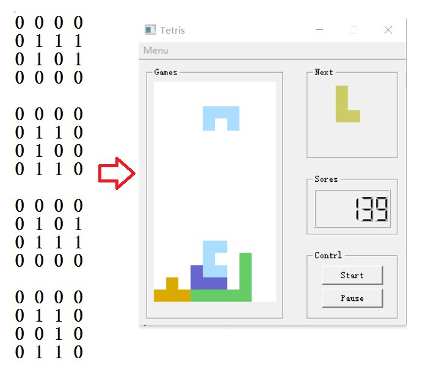

## 基于QT的俄罗斯方块游戏demo

最近整理资料，发现学生时代自己写了一个俄罗斯方块的小游戏，基于QT开发的；
干脆就开源给大家玩玩。支持自定义的方块，编辑in.txt 文件即可；

## 游戏界面

## 查看in.txt文件

## 修改一个方块

注意需要修改四个，每个方块的四个形状，按照逆时针顺序编写；

## 联系方式
在使用中有任何问题，欢迎反馈给我，可以用以下联系方式跟我交流

* Email: linimbus@126.com
* QQ: 279402099
